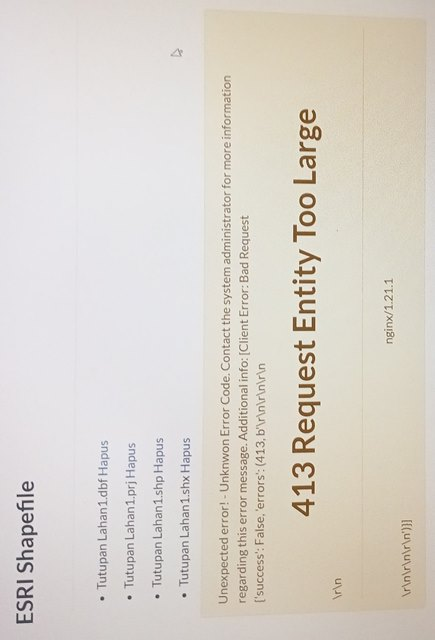

# Install Python

apt update   
`sudo apt-get update`   

Install python2   
`sudo apt-get install python`

Install python3 default (3.6)   
`sudo apt-get install python3`

Install python3.7   
`sudo apt-get install python3.7`

___    
## Cek Versi Python

Cek versi python2   
`python --version`

Cek versi python3 default (3.6)    
`python3 --version`

Cek versi python3.7   
`python3.7 --version`

#   
# Install Python-Django

Install python-django   
`sudo apt-get install python-django`

Jika menggunakan python3 gunakan command berikut   
`sudo apt-get install python3-django`

___   
## Cek Versi Python-Django

Cek versi python-django atau django-admin   
`django-admin --version`

#   
# Install Docker Engine

Lihat di sini:   
[https://docs.docker.com/engine/install/ubuntu/](https://docs.docker.com/engine/install/ubuntu/)   
   
Catatan:   
Jika instalasi docker pada bagian berikut ini error   
 sudo apt-get install \   
    ca-certificates \   
    curl \   
    gnupg \   
    lsb-release   
   
Ubah command menjadi
`
 sudo apt-get install ca-certificates curl gnupg lsb-release
`

___   
## Docker Engine Linux Post Install

Lihat di sini:   
[https://docs.docker.com/engine/install/linux-postinstall/](https://docs.docker.com/engine/install/linux-postinstall/)

___   
## Install Docker Compose

Lihat di sini:  
[https://docs.docker.com/compose/install/](https://docs.docker.com/compose/install/)

___   
## Cek Versi Docker, Docker Compose

Cek versi docker   
`docker --version`

Cek versi docker-compose   
`docker-compose --version`

___   
## Configure where the Docker daemon listens for connections

Reload the systemctl configuration   
`sudo systemctl daemon-reload`   

Restart Docker   
`sudo systemctl restart docker.service`

#   
# Clone Cartoview 1.30.0

Install Git   
`sudo apt-get update`   
`sudo apt-get install git`

Clone Cartoview 1.30.0   
`git clone -b 1.30.0 https://github.com/cartologic/cartoview.git`

___   
Cara git clone spesifik branch seperti ini   
`git clone -b <branchname> <remote-repo-url>`

___    
> clone cartoview di dalam folder */home/[USERNAME]/*

#   
# Configuration Cartoview for Production

Cek ipaddress server   
`ifconfig`

___   
## Ubah /cartoview/env/celery.env

`GEOSERVER_PUBLIC_LOCATION=http://10.5.0.4/geoserver/`   
ubah menjadi   
`GEOSERVER_PUBLIC_LOCATION=http://[your_ipaddress_or_domain]/geoserver/`

`GEOSERVER_LOCATION=http://geoserver:8080/geoserver/`   
ubah menjadi   
`GEOSERVER_LOCATION=http://[your_ipaddress_or_domain_without_port]/geoserver/`

`SITEURL=http://10.5.0.4/`   
ubah menjadi   
`SITEURL=http://[your_ipaddress_or_domain]/`

___   
## Change /cartoview/env/django.env

`GEOSERVER_PUBLIC_LOCATION=http://10.5.0.4/geoserver/`   
ubah menjadi   
`GEOSERVER_PUBLIC_LOCATION=http://[your_ipaddress_or_domain]/geoserver/`

`GEOSERVER_LOCATION=http://geoserver:8080/geoserver/`   
ubah menjadi   
`GEOSERVER_LOCATION=http://[your_ipaddress_or_domain_without_port]/geoserver/`

`SITEURL=http://10.5.0.4/`   
ubah menjadi   
`SITEURL=http://[your_ipaddress_or_domain]/`

___   
## Change /cartoview/scripts/nginx/nginx.conf

`server_name localhost;`   
ubah menjadi   
`server_name [your_ipaddress_or_domain];`

___   
## Solusi 413 Request Entity Too Large Ketika Upload Layer

   
masih pada /cartoview/scripts/nginx/nginx.conf   
copy syntax   
`client_max_body_size 1024M;`   
paste di atas   
`location  / {`   
sehingga berada di dalam   
`server {`

___   
## local_settings.py

Copy **local_settings.py.sample** menjadi **local_settings.py** pada direktor /cartoview/cartoview

___   
## Ubah /cartoview/cartoview/local_settings.py

SITEURL = "http://localhost:8000/"   
ubah menjadi   
SITEURL  =  "http://[your_ipaddress_or_domain]/"

___   
## Hapus atau nonaktifkan syntax config database

<pre>
DATABASES = {    
    'default': {
        'ENGINE': 'django.contrib.gis.db.backends.postgis',   
        'NAME': 'cartoview2',   
        'USER': 'postgres',   
        'PASSWORD': 'postgis',   
        'HOST': 'localhost',   
        'PORT': '5432',   
    },   
    # vector datastore for uploads   
    'datastore': {   
        'ENGINE': 'django.contrib.gis.db.backends.postgis',   
        # 'ENGINE': '', # Empty ENGINE name disables   
        'NAME': 'cartoview2_datastore',   
        'USER': 'postgres',   
        'PASSWORD': 'postgis',   
        'HOST': 'localhost',   
        'PORT': '5432',   
    }   
}
</pre>   

Jika dinonaktifkan ubah menjadi   
<pre>
#DATABASES = {    
#    'default': {
#        'ENGINE': 'django.contrib.gis.db.backends.postgis',   
#        'NAME': 'cartoview2',   
#        'USER': 'postgres',   
#        'PASSWORD': 'postgis',   
#        'HOST': 'localhost',   
#        'PORT': '5432',   
#    },   
#    # vector datastore for uploads   
#    'datastore': {   
#        'ENGINE': 'django.contrib.gis.db.backends.postgis',   
#        # 'ENGINE': '', # Empty ENGINE name disables   
#        'NAME': 'cartoview2_datastore',   
#        'USER': 'postgres',   
#        'PASSWORD': 'postgis',   
#        'HOST': 'localhost',   
#        'PORT': '5432',   
#    }   
#}
</pre>   

___   
## Disable register form

Tambahkan syntax berikut pada **local_settings.py**   
`ACCOUNT_OPEN_SIGNUP = False`

___   
## Ubah default language

Tambahkan syntax berikut pada **local_settings.py**   
`LANGUAGE_CODE = 'id'`

___   
## Ubah Titik Tengah dan Zoom Peta

`DEFAULT_MAP_CENTER = (0,0)`   
ubah menjadi   
`DEFAULT_MAP_CENTER = (longitude, latitude)`   

Contoh untuk wilayah D.I. Yogyakarta   
`DEFAULT_MAP_CENTER = (110.4304504, -7.8766453)`

`DEFAULT_MAP_ZOOM = 0`   
ubah menjadi   
`DEFAULT_MAP_ZOOM = 11`

#

# Menjalankan Cartoview

Install make   
`sudo apt-get install make`

Masuk ke folder cartoview   
`cd cartoview`

Jalankan cartoview untuk pertama kali   
`make run`

Untuk stop cartoview   
`make down`

Menjalankan kembali cartoview setelah distop   
`make up`

#

# Catatan Penting!!!

Jika terjadi masalah pada cartoview kemudian melakukan **make down** untuk menonaktifkan cartoview, untuk menjalankan cartoview lagi gunakan **make up**

Jika menjalankan cartoview lagi menggunakan **make run** maka akan ada proses migrate data sehingga konfigurasi seperti password admin yang telah diganti, akan direset ulang ke password default-nya.

Jika terpaksa akan menjalankan **make run** untuk selanjutnya karena syntax **make up** tidak bekerja sempurna, maka ubah dulu syntax pada file **/cartoview/Makefile** di bagian   
`run: up wait prepare_oauth prepare_manager sync collect_static backfill_api_keys`   
menjadi   
`run: up wait collect_static`   

___   
Jika mengubah password default GeoServer, maka ubah syntax pada file /cartoview/cartoview/local_settings.py

`'GEOSERVER_ADMIN_PASSWORD', 'geoserver'`   
ubah menjadi   
`'GEOSERVER_ADMIN_PASSWORD', '[Your_Geoserver_Password]'`

#
> unsorry@2021